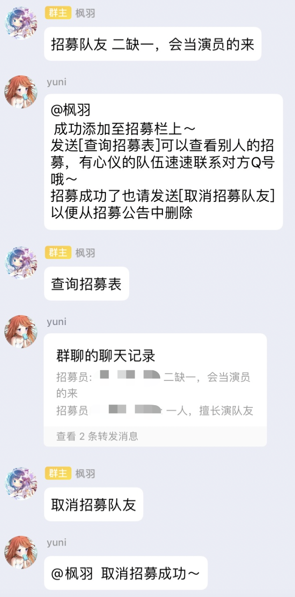
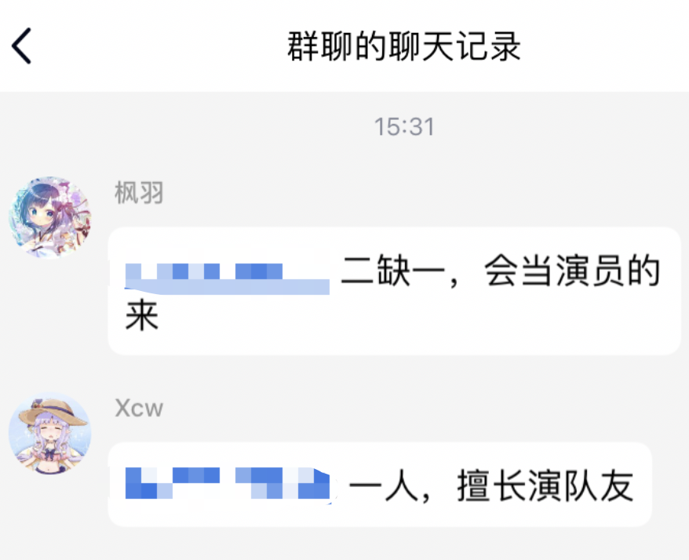

# 招募队友

想参加~~ACM,CTF~~赛却奈何找不到队友，亦或二缺一，三缺一，不知上哪找？本插件可以满足您的要求！

本插件可发布招募帖，写上目前的情况和请求，就能让更多的人看到！

## 安装方法

在`HoshinoBot/hoshino/modules`目录下使用以下命令拉取本项目

```bash
git clone https://github.com/Lanly109/teamup.git
```

进入该目录后使用如下命令安装依赖

然后在`HoshinoBot/hoshino/config/__bot__.py`文件的`MODULES_ON`加入`teamup`


## 使用方法

- 招募队友 [情况说明]

发布一个招募帖

- 取消招募队友

取消之前发布的招募帖

- 查看招募表

查看目前的招募帖

## 使用示例





（由于没想到好的招募表的样式，用转发的形式做出来感觉也不错，主要是能有个Q号能点击方便找到招募的人，同时又有头像辅助辨认+不刷屏）
